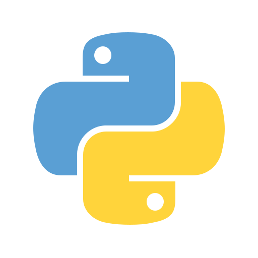
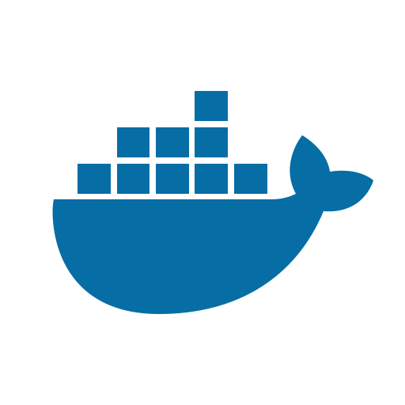

# 🐈 Iván Pérez Fernández 🌐

I am a Cloud Engineer, Networking specialist and SysAdmin!

---

## Languages and tech I am in love with 💻

<dl>
    <dt>Scripting:
    <dd>
        
        
        
        
    </dd>
    </dt>
    <dt>Google Cloud Platform Suite:
    <dd>
        
        
        
        
        
        
        
    </dd>
    </dt>
    <dt>Frontend:
    <dd>
        </dd>
    </dt>
    <dt>Backend:
    <dd>
        
        
        </dd>
    </dt>
    <dt>Others:
    <dd>
        
        
        
    </dd>
    </dt>
</dl>

---

## I’m most proud of 💻

### Projects

- 🐈 [Sakamoto](https://github.com/taichikuji/Sakamoto), a fun, easy to use, deploy and play around Discord Music Bot! It is a direct in-place replacement for Miia-Py (which used Discord.py v1), and direct follow-up of Ui-Py!
- 🌐 [DiscordID](https://github.com/taichikuji/discordid), complete dynamic website that allows you to share and let people add your Discord profile as friends. <u>Built using Netlify and Node.js</u>
- 📋 [Simplemenu](https://github.com/taichikuji/simplemenu), Simplemenu is a project that replaces the default launcher for the multiple single-board devices that support it, including but not limited to, the Powkiddy v90! Written in C + Shell
- ⚡ My TRMNL plugins!, [TRMNL-Frank-Energie-Plugin](https://github.com/taichikuji/trmnl-frank-energie-plugin) | [TRMNL-TMB-Plugin](https://github.com/taichikuji/trmnl-tmb-plugin) | [TRMNL-LaLiga-Plugin](https://github.com/taichikuji/trmnl-laliga-plugin) | [TRMNL-HTTP-Pets-Plugin](https://github.com/taichikuji/trmnl-http-pets-plugin)
- 🗂️ [Stasher](https://github.com/taichikuji/Stasher), Stasher is a Chromium compatible extension that is yet another attempt at managing tabs and tab groups. Stash, Recover, and save on memory while staying focused on your tasks!
---

    
⚡ Stats

    
⚡ Connect with me

